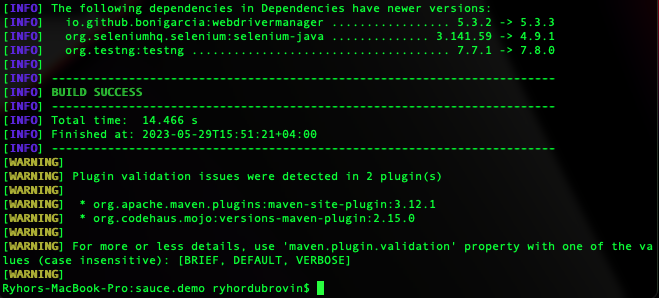
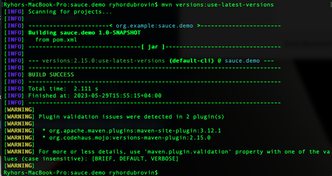
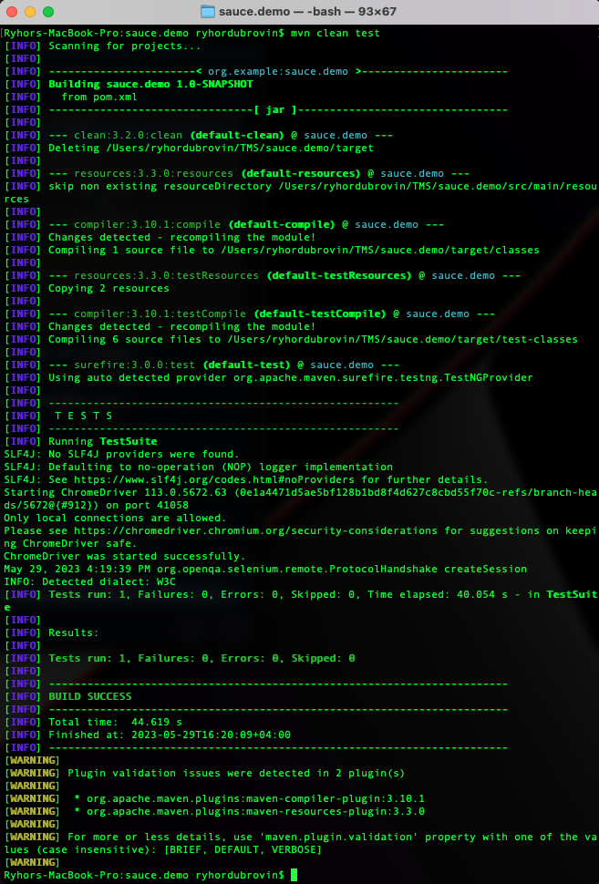
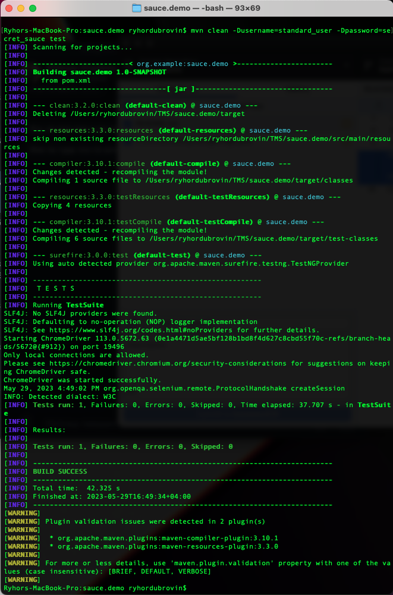
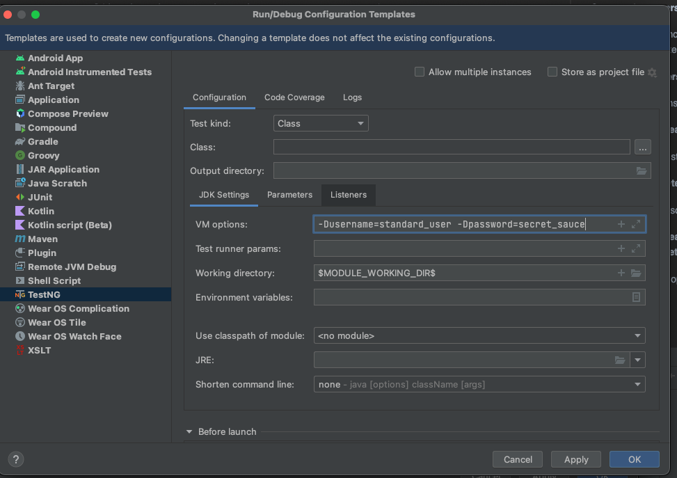

<h2>MVN Commands report</h2>

Command mvn <strong>versions:display-dependency-updates</strong>

Command <strong>mvn versions:use-latest-versions</strong>

Command <strong>mvn clean test</strong>

Command <strong>mvn -Dtest=SauceDemoTest test</strong>

Command <strong>mvn clean -Dusername=standard_user -Dpassword=secret_sauce test</strong>

<h3>Add TestNG template</h3>
